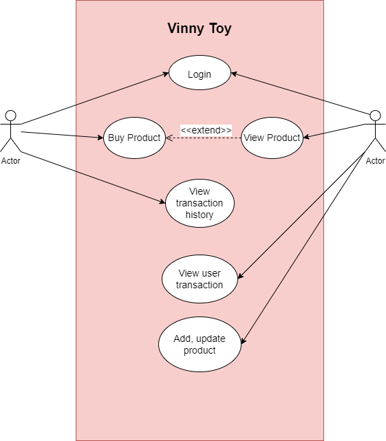

## 1. Tổng quan
**Vinney Toy** là một shop bán đồ chơi với các chức năng đăng nhập, mua đồ, quản lý lịch sử mua đồ số tiền của khác hàng sẽ được trừ trực tiếp vào E-wallet của khách hàng.
Nếu mua hàng thành công thì số tiền đấy sẽ được truyển trực tiếp vào E-wallet của chủ cửa hàng.

## 2. Các đối tượng của hệ thống cần mô tả.
* Khách hàng: Bao gồm số tài khoản E-wallet, số dư tài khoản, thông tin cá nhân
* Toy: Bao gồm hình ảnh, thông tin sản phẩm.
* Lịch sử giao dịch: Bao gồm thời gian, món đồ đã mua, số dư tài khoản trước và sau.

## 3. Các đối tượng của hệ thống.
* Khách hàng
* Chủ shop

## 4. Chức năng của hệ thống
* (Tất cả) Xem các sản phẩm của cửa hàng
* (Khách hàng) Mua các sản phản của cửa hàng
* (Khách hàng) Đăng nhập để xem các giao dịch đã mua 
* (Khách hàng) Đăng xuất tài khoản
* (Khách hàng) De-active tài khoản -> De-active e-wallet
* (Chủ shop) Quản lý những giao dịch của khách hàng 
* (Chủ shop) Sửa xóa sản phẩm
* (Chủ shop) Xem những giao dịch mua hàng

## 5. Use Case Diagram
